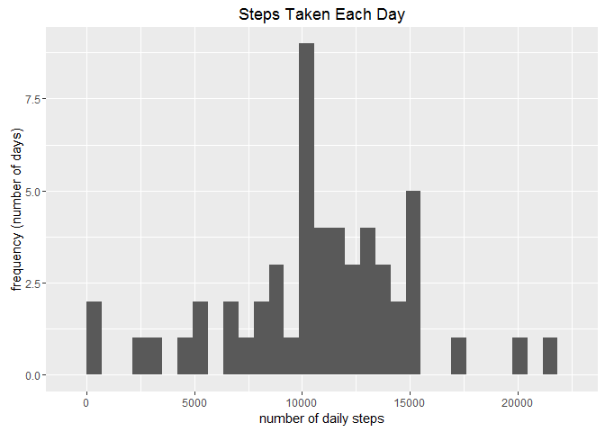
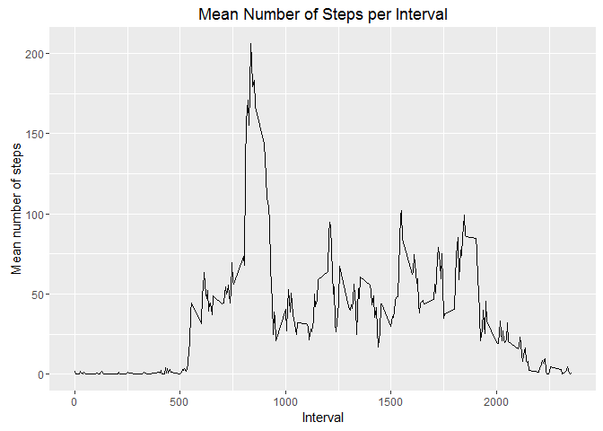
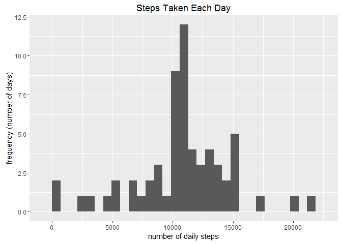

# Reproducible Research: Peer Assessment 1
  
## Loading and preprocessing the data
 
The data is loaded by first unzipping the "activity.zip" csv file, and then reading in the data as a data table using the `fread()` function from the `data.table` package. First, unzip the csv file:    


```r
con <- unzip("activity.zip")
```

This will create an unzipped .csv file called "activity.csv" in the current working directory.  
  
Now read in the data:  

```r
library(data.table)

D <- fread("activity.csv",na.strings = "NA", stringsAsFactors = FALSE)
```
  
## What is mean total number of steps taken per day?
 
We want to ignore the missing values in the dataset for this question, so we start by creating a logic vector that tells us which rows are complete (i.e. do not contain NA's in any column). We will call the data frame to be used for this question "Q1Data".


```r
completeLogic <- complete.cases(D)

Q1Data <- D[completeLogic,]
```

We could make sure that the "date" column in the data frame contains date-type objects by calling the `as.Date()` function:


```r
Q1Data$date <- as.Date(Q1Data$date)
```

Now we can use the `group_by()` function from the `dplyr` package to group the data by date, to which we can then apply the `summarise_each()` function to get the sum of the number of steps over all intervals for each day:


```r
library(dplyr)

grouped <- group_by(Q1Data,date)

summTotSteps <- summarise_each(grouped,funs(sum(.,na.rm=T)),steps)
```

We technically don't need to include the `na.rm=T` argument in the call to `sum()`, as we've already subset the dataset to not include missing values.

Now we want to make a histogram showing the total number of steps taken each day. We can do this using the `ggplot2` package:

```r
library(ggplot2)

p = ggplot(data=summTotSteps, aes(steps)) + geom_histogram() +
        labs(title="Steps Taken Each Day") +
        labs(x="number of daily steps", y="frequency (number of days)")

print(p)
```



To calculate the mean and median values for the total number of steps taken each day, we just need to apply the `mean()` and `median()` functions to the summarised dataset:


```r
summ_mean <- mean(summTotSteps$steps)
print(summ_mean)
```

```
## [1] 10766.19
```

```r
summ_median <- median(summTotSteps$steps)
print(summ_median)
```

```
## [1] 10765
```

So we can see that the mean total number of steps taken each day was 1.0766189\times 10^{4}, and the median value was 10765 steps.
  
## What is the average daily activity pattern?
 
We now want to make a time series (line) plot of the data showing the 5-minute interval average number of steps taken across all the days in the dataset. We start by using the `group_by()` and `summarise_each()` functions to group the data by interval this time, and then applying the `mean()` function to each interval:


```r
grouped <- group_by(Q1Data,interval)
summIntervalMean <- summarise_each(grouped,funs(mean(.,na.rm=T)),steps)
```

and then plot:


```r
p = ggplot(data=summIntervalMean, aes(interval,steps)) + geom_line() +
        labs(title="Mean Number of Steps per Interval") +
        labs(x="Interval", y="Mean number of steps")
print(p)
```



To find the 5-minute interval with the maximum mean number of steps, averaged across all of the days in the dataset, we look for the rows in the "summIntervalMean"" dataset (X is used in the code below to save space) in which the value in the "steps" column is equal to the maximum of the entire "steps" column.


```r
X <- summIntervalMean
maxMeanStepsTable    <- X[(X$steps == max(X$steps)),]
```

This creates a table with the names "interval" and "steps", allowing multiple instances of the maximum to be found in the "summIntervalMean" dataset. In this case there is only one though...

Then, the maximum "steps"" value and its corresponding "interval" is found by accessing the appropriate columns:


```r
maxMeanStepsCount    <- maxMeanStepsTable$steps
print (maxMeanStepsCount)
```

```
## [1] 206.1698
```

```r
maxMeanStepsInterval <- maxMeanStepsTable$interval
print(maxMeanStepsInterval)
```

```
## [1] 835
```

So it is found that the max number of steps, averaged across all of the days, was 206.1698113 and is found in interval 835. 
  
## Inputting missing values
 
To calculate the total number of missing values in the original dataset, we just need to create a logic vector telling us which rows contain "NA" in the "steps" column using the `is.na()` function, and then sum the values - this will count the number of occurunces of `TRUE` in this logic vector.


```r
missingData      <- is.na(D$steps)
missingDataCount <- sum(missingData)

print(missingDataCount)
```

```
## [1] 2304
```

There are 2304 missing values in the original dataset.

We need to devise a strategy to fill in the missing data. After very little thought, it was decided to fill in the missing steps with the average value of steps (taken across all of the days) for its given 5-minute interval.

This starts by copying the original dataset (with missing data). For each row in this dataset, check if the value in the "steps" column is missing. If it is, the "NA" value is replaced with the value that is found in the "summIntervalMean" table (renamed "X" to shorten the variable name!) created previously.The "summIntervalMean" acts as a lookup table, so the interval corresponding to the missing value, `D$interval[i]`, is looked up in the `X$interval` column, and the corresponding `X$steps` value is returned.


```r
filledData <- D

for (i in seq(1:nrow(D))){
        if (is.na(D$steps[i])){
                filledData$steps[i]=X$steps[(X$interval==D$interval[i])]
        }
}
```

The "filledData" is now the original dataset but with the missing values filled in!

We want to now find the mean and median of the total number of steps taken per day, but this time with the filled in dataset. The procedure is the same as before, but now using the filled dataset:


```r
grouped <- group_by(filledData,date)
summTotStepsFilled <- summarise_each(grouped,funs(sum(.,na.rm=T)),steps)
```

We can plot this in a histogram to see what the data looks like:


```r
p = ggplot(data=summTotStepsFilled, aes(steps)) + geom_histogram() +
        labs(title="Steps Taken Each Day") +
        labs(x="number of daily steps", y="frequency (number of days)")
print(p)
```



and then find the mean and median using the `mean()` and `median()` functions, as before.


```r
summFilled_mean <- mean(summTotStepsFilled$steps)
print(summFilled_mean)
```

```
## [1] 10766.19
```

```r
summFilled_median <- median(summTotStepsFilled$steps)
print(summFilled_median)
```

```
## [1] 10766.19
```

We can see how these values compare to the original dataset with values missing:

<!-- html table generated in R 3.2.3 by xtable 1.8-2 package -->
<!-- Thu Feb 11 00:15:25 2016 -->
<table border=1>
<tr> <th>  </th> <th> mean </th> <th> median </th>  </tr>
  <tr> <td align="right"> Original </td> <td align="right"> 10766.19 </td> <td align="right"> 10765.00 </td> </tr>
  <tr> <td align="right"> After Filling </td> <td align="right"> 10766.19 </td> <td align="right"> 10766.19 </td> </tr>
   </table>
 
The filled dataset has the same mean total number of steps per day as the original dataset - this is maybe unsurprising as the missing values were filled in with the mean of the appropriate interval. The median is now slightly higher (by one step :S) than in the original dataset, and is (weirdly) the same as the mean.
  
## Are there differences in activity patterns between weekdays and weekends?
 
We would now like to see how the number of steps taken during weekdays compares to the total number of steps taken over the weekend.

The aim is to create a new factor variable in the dataset with two levels - "weekday" and "weekend", and then produce a panel plot containing a time series of the number of steps taken against 5-minute interval.

First, the filled dataset is copied and the `$date` column is set to a date object using the `as.Date()` function. A new column, `$day` is added, which converts the `$date` values to their weekday names, using the `weekdays()` function.


```r
Q4Data <- filledData
Q4Data$date <- as.Date(Q4Data$date)
Q4Data$day <- weekdays(Q4Data$date)
```

Next, a logic vector is set up by checking whether the day in the `$day` column is either a Saturday or a Sunday:


```r
weekend <- (Q4Data$day =="Saturday") | (Q4Data$day =="Sunday")

Q4Data$weekend=factor(weekend)

levels(Q4Data$weekend) <- c("weekday","weekend")
```

The mean number of total steps for each interval is found as before:


```r
grouped <- group_by(Q4Data,weekend,interval)
summIntervalMeanWeekday <- summarise_each(grouped,funs(mean(.,na.rm=T)),steps)
```

Now we can make a time series panel plot using the `lattice` package:


```r
library(lattice)

xyplot(steps ~ interval| weekend, 
       data = summIntervalMeanWeekday,
       type = "l",
       xlab = "Interval",
       ylab = "Number of steps",
       layout=c(1,2))
```


